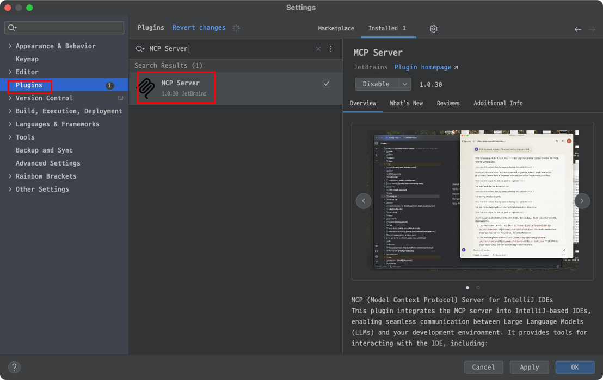

# Jetbrains MCP 설치 가이드

## Install Jetbrains MCP Server

- claude_desktop_config.json 파일에 jetbrains MCP 서버를 추가

```json
{
  "mcpServers": {
    ...
    "jetbrains": {
      "command": "npx",
      "args": [
        "-y",
        "@jetbrains/mcp-proxy"
      ]
    }
    ...
}
```

## intelliJ MCP 플러그인 설치

