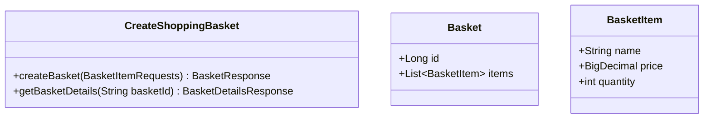
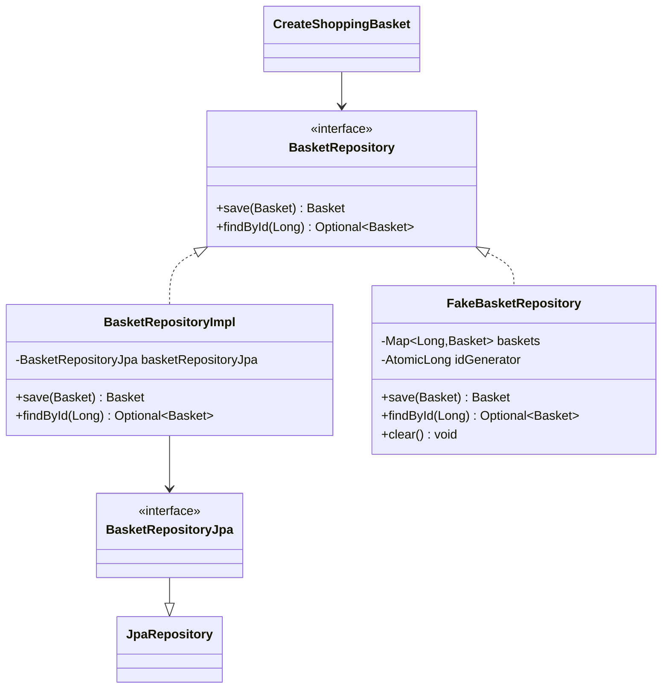

# AI와 Pair로 CreateShoppingBasket Usecase를 TDD로 구현하기

## Claude chatting

- first: https://claude.ai/share/fb917cce-3b60-492b-aa40-79c7cc62fa92
- second: https://claude.ai/share/30d46a02-a5d9-4bbc-91c3-410edad5dfe2

## 전체적인 절차

## 1. **SRS(소프트웨어 요구사항 명세서) 작성**

### CreateShoppingBasket 규칙 및 요구사항

- 규칙
    - 기본 규칙
        - 고객은 장바구니에 상품을 추가할 수 있음
        - 각 상품은 상품명, 단가, 수량 정보를 가짐
        - 장바구니에는 여러 종류의 상품을 담을 수 있음
        - 동일한 상품을 여러 개 담을 수 있음
    - 할인 규칙
        - 총 금액이 20,000원 이상이면 10% 할인 적용
        - 총 금액이 10,000원 초과 20,000원 미만이면 5% 할인 적용
        - 총 금액이 10,000원 이하면 할인 없음
        - 할인은 소계 금액에 적용됨

- 영수증 생성 요구사항
    - 기본 영수증 구성
        - 시스템은 장바구니의 모든 상품 정보를 영수증에 포함해야 함
        - 각 상품별로 상품명, 단가, 수량, 총액을 표시해야 함
        - 소계 금액을 계산하여 표시해야 함
    - 할인 계산 및 표시
        - 적용된 할인율과 할인 금액을 명시해야 함
        - 할인이 적용되지 않은 경우 할인 금액은 0원으로 표시
        - 최종 결제 금액은 소계에서 할인 금액을 뺀 값으로 계산
    - 예외 처리
        - 장바구니가 비어있으면 영수증을 생성할 수 없음
        - 시스템은 적절한 오류 메시지와 함께 예외를 발생시켜야 함

- 총액 계산 요구사항
    - 기본 계산
        - 각 상품의 총액은 단가 × 수량으로 계산
        - 소계는 모든 상품 총액의 합계
        - 최종 결제 금액은 소계에서 할인 금액을 뺀 값

## 2. **SRS를 잘 설명할 수 있는 예제 목록 작성**

### CreateShoppingBasket 예제

- 예제1: 정확히 20,000원 - 10% 할인 적용
    - 스마트폰 케이스 1개 (단가: 15,000원, 총액: 15,000원)
    - 보호필름 1개 (단가: 5,000원, 총액: 5,000원)
    - 소계: 20,000원
    - 할인: 2,000원 (10% 할인)
    - 최종 결제 금액: 18,000원

- 예제2: 10,000원 초과 20,000원 미만 - 5% 할인 적용
    - 스마트폰 케이스 1개 (단가: 12,000원, 총액: 12,000원)
    - 보호필름 1개 (단가: 3,000원, 총액: 3,000원)
    - 소계: 15,000원
    - 할인: 750원 (5% 할인)
    - 최종 결제 금액: 14,250원

- 예제3: 10,000원 이하 - 할인 없음
    - 충전 케이블 1개 (단가: 8,000원, 총액: 8,000원)
    - 소계: 8,000원
    - 할인: 0원 (할인 없음)
    - 최종 결제 금액: 8,000원

- 예제4: 빈 장바구니 - 예외 발생
    - 장바구니에 상품이 없음
    - 영수증 생성 시도 시 예외 발생
    - 시스템은 적절한 오류 메시지와 함께 예외를 발생시켜야 함

## 3. **High Level Test 작성**

### 대표 예제 선택

- 예제1 (정확히 20,000원 - 10% 할인 적용)을 대표 예제로 선택
- 이 예제는 여러 상품, 할인 적용, 복잡한 계산을 포함하여 요구사항의 제약 조건을 가장 많이 충족함
- 이 예제를 통해 구현할 기능의 전체적인 흐름과 목표 설계를 파악할 수 있음

### 클래스 다이어그램

#### 도메인 모델



#### Repository 구조



## 4. **테스트 케이스 목록 작성**

### CreateShoppingBasket을 위한 테스트 리스트

- 가장 단순한 특수 케이스(degenerate)에서 일반적인 케이스(general)로 진행하는 테스트 리스트:
- [ ] 빈 장바구니에서 청구서 요청 시 예외 발생
- [ ] 단일 상품을 1개만 장바구니에 추가 (할인 없음, 10,000원 이하)
- [ ] 10,000원 초과 20,000원 미만 구매 시 5% 할인 적용
- [ ] 정확히 20,000원 구매 시 10% 할인 적용

## 5. **Walking Skeleton 구현**

## 6. **테스트 리스트에서 테스트 선택해서 테스트 추가하기(더 이상 추가할 테스트가 없을때까지)**

### 6.1 빈 장바구니 예외 처리 테스트 추가

빈 장바구니에서 영수증 생성 요청 시 예외 발생 테스트를 구현했습니다.

- 가장 단순한 degenerate case부터 시작
- IllegalArgumentException을 발생시키고 @RestControllerAdvice로 글로벌 예외 처리
- BadRequest(400) 상태코드와 함께 에러 메시지 반환

### 6.2 단일 상품 추가 테스트 (할인 없음)

단일 상품을 장바구니에 추가하고 할인 없는 영수증 생성 테스트를 구현했습니다.

- 하드코딩된 Controller 로직을 실제 계산 로직으로 변경
- 상품별 총액 계산 (단가 × 수량) 구현
- 소계, 할인, 최종 금액 계산 로직 추가

### 6.3 5% 할인 적용 테스트 (10,000원 초과 20,000원 미만)

10,000원 초과 20,000원 미만 구매 시 5% 할인 적용 테스트를 구현했습니다.

- 여러 상품 추가 시나리오로 확장
- 소계 금액에 따른 조건부 할인 로직 추가
- 5% 할인율과 할인 금액 계산 구현

### 6.4 10% 할인 적용 테스트 (20,000원 이상)

정확히 20,000원 구매 시 10% 할인 적용 테스트를 구현했습니다.

- 완전한 할인 정책 구현 (할인 없음, 5% 할인, 10% 할인)
- if-else 조건문을 통한 할인율 결정 로직 완성
- 모든 테스트 케이스가 성공하는 기본 기능 완료

## 7. **High Level Test 활성화**

## 8. **Jpa Repository 구현**

## 진행 내역

### 9. **테스트 코드 DSL 개선**

Test Data Builder와 Protocol Driver를 적용하여 테스트 코드의 가독성과 재사용성을 크게 개선했습니다.

#### 주요 개선 사항:

1. **Test Data Builder 패턴 적용**
    - `BasketBuilder`: 장바구니 생성을 위한 fluent interface 제공
    - `ItemBuilder`: 상품 생성을 위한 builder 패턴
    - DSL 스타일의 테스트 데이터 생성: `aBasket().withItem(anItem("상품명").withPrice(15000).withQuantity(1))`

2. **Protocol Driver 구현**
    - `BasketApi`: MockMvc 호출을 캡슐화하는 API 계층
    - 반복되는 HTTP 호출 로직을 하나의 클래스로 집중
    - 테스트와 시스템 간의 통신 프로토콜을 추상화

3. **중복 제거 및 가독성 향상**
    - 각 테스트 메서드가 3줄로 단순화됨 (given & when / then)
    - 하드코딩된 영수증 출력 메서드들을 하나의 동적 메서드로 통합
    - Walking Skeleton 테스트 제거 (기존 테스트와 중복)

4. **코드 품질 개선**
    - 통화 포맷팅 로직 분리 (`formatCurrency` 메서드)
    - 영수증 출력 로직 개선 (동적 생성)
    - 에러 처리 로직 명확화

#### 개선된 테스트 구조:

```java
// Before: 복잡하고 중복이 많은 코드
@Test
void test() throws Exception {
    BasketItemRequests items = new BasketItemRequests(List.of(
            new BasketItemRequest("상품명", BigDecimal.valueOf(15000), 1)
    ));

    MvcResult postResult = mockMvc.perform(post("/api/baskets")...)
    // ... 복잡한 HTTP 호출 및 응답 처리
}

// After: 간결하고 의도가 명확한 DSL
@Test
void test() throws Exception {
    String basketId = basketApi().createBasket(
            aBasket().withItem(anItem("상품명").withPrice(15000).withQuantity(1))
    );

    verifyBasketReceipt(basketApi().getBasketDetails(basketId));
}
```

이제 테스트 코드가 훨씬 읽기 쉽고 유지보수하기 좋아졌으며, 새로운 테스트 케이스를 추가할 때 중복 코드 없이 쉽게 작성할 수 있습니다.

### 10. **JPA Repository 구현**

Fake Repository로 모든 기능이 동작하는 것을 확인한 후, 실제 데이터베이스 연동을 위한 JPA Repository를 구현했습니다.

#### 주요 구현 사항:

1. **JPA 엔티티 매핑**
    - `Basket` 엔티티: `@Entity`, `@Id`, `@GeneratedValue` 추가
    - `BasketItem` 엔티티: `@ManyToOne` 관계 설정
    - 양방향 연관관계 매핑 및 Cascade 설정

2. **Spring Data JPA Repository 생성**
    - `BasketRepositoryJpa`: JpaRepository를 상속하는 인터페이스
    - Spring Data JPA의 기본 CRUD 기능 활용

3. **Repository 구현체 작성**
    - `BasketRepositoryImpl`: BasketRepository 인터페이스 구현
    - BasketRepositoryJpa에 대부분의 작업을 위임
    - Fake Repository와 JPA Repository 간 쉬운 전환 가능

4. **테스트 설정 변경**
    - `@TestConfiguration` 주석 처리로 JPA Repository 사용
    - Fake Repository는 테스트 시에만 필요시 활성화 가능

#### Repository 아키텍처의 장점:

- **유연성**: Fake Repository와 JPA Repository 간 쉬운 전환
- **테스트 용이성**: 테스트 시 빠른 in-memory repository 사용 가능
- **확장성**: 새로운 Repository 구현체 추가 용이
- **의존성 역전**: 상위 계층이 구체적인 구현이 아닌 인터페이스에 의존

이제 실제 데이터베이스와 연동하여 장바구니 기능을 사용할 수 있습니다. spring-boot-docker-compose를 통해 데이터베이스에 연결하면 모든 기능이 정상 동작합니다.

