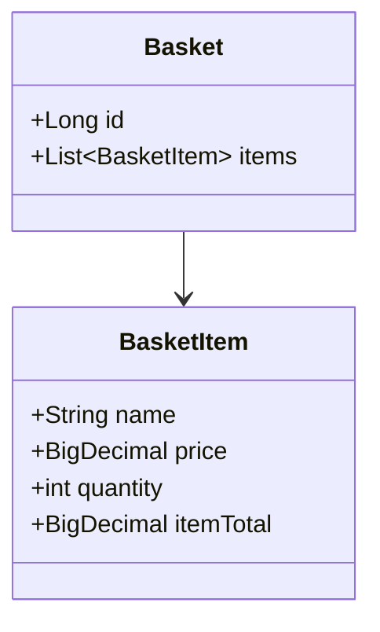

# CreateShoppingBasket TDD 구현

## 전체적인 절차

## 1. **SRS(소프트웨어 요구사항 명세서) 작성**

### CreateShoppingBasket 규칙 및 요구사항

- 규칙
    - 기본 규칙
        - 사용자는 장바구니에 상품을 추가할 수 있음
        - 각 상품은 이름, 단가, 수량을 가짐
        - 총 가격은 `단가 * 수량`의 합계임
    - 예외 처리 규칙
        - 장바구니가 비어 있으면 청구서를 생성할 수 없음
        - 빈 장바구니에서 영수증 생성을 요청하면 시스템은 적절한 오류 메시지와 함께 예외를 발생시켜야 함
    - 할인 정책
        - 총 금액이 20,000원 이상이면 10% 할인 제공
        - 총 금액이 10,000원 초과 20,000원 미만이면 5% 할인 제공
        - 총 금액이 10,000원 이하면 할인 없음
- 청구서 생성 요구사항
    - 기본 청구서 정보
        - 시스템은 장바구니의 각 상품 정보(이름, 단가, 수량, 총액)를 표시해야 함
        - 소계(할인 전 총액)를 계산하고 표시해야 함
        - 적용된 할인 금액과 할인율을 표시해야 함
        - 최종 결제 금액(할인 후 금액)을 계산하고 표시해야 함
    - 청구서 형식
        - 영수증 형태로 품목별 상세 정보를 나열
        - 소계, 할인, 최종 결제 금액을 명확히 구분하여 표시
        - 할인이 적용된 경우 할인율을 함께 표시

## 2. **SRS를 잘 설명할 수 있는 예제 목록 작성**

### CreateShoppingBasket 예제

- 예제1: 빈 장바구니 - 청구서 발행 불가
    - 장바구니에 상품이 없는 상태에서 영수증 생성 요청
    - 기대 결과: 시스템은 적절한 오류 메시지와 함께 예외를 발생시켜야 함

- 예제2: 10,000원 이하 - 할인 없음
    - 보호필름 2개 (단가: 5,000원, 총액: 10,000원)
    - 소계: 10,000원
    - 할인: 0원 (할인 없음)
    - 최종 결제 금액: 10,000원

- 예제3: 10,000원 초과 20,000원 미만 - 5% 할인 적용
    - 스마트폰 케이스 1개 (단가: 12,000원, 총액: 12,000원)
    - 보호필름 1개 (단가: 5,000원, 총액: 5,000원)
    - 소계: 17,000원
    - 할인: 850원 (5% 할인)
    - 최종 결제 금액: 16,150원

- 예제4: 정확히 20,000원 - 10% 할인 적용
    - 스마트폰 케이스 1개 (단가: 15,000원, 총액: 15,000원)
    - 보호필름 1개 (단가: 5,000원, 총액: 5,000원)
    - 소계: 20,000원
    - 할인: 2,000원 (10% 할인)
    - 최종 결제 금액: 18,000원

- 예제5: 20,000원 초과 - 10% 할인 적용 (복합 예제)
    - 스마트폰 케이스 1개 (단가: 15,000원, 총액: 15,000원)
    - 보호필름 2개 (단가: 5,000원, 총액: 10,000원)
    - 충전 케이블 1개 (단가: 8,000원, 총액: 8,000원)
    - 소계: 33,000원
    - 할인: 3,300원 (10% 할인)
    - 최종 결제 금액: 29,700원

## 3. **High Level Test 작성**

### 대표 예제 선택
- 선택된 예제: 예제5 (20,000원 초과 - 10% 할인 적용)
- 선택 이유: 여러 상품, 수량 처리, 할인 계산 등 가장 많은 제약 조건을 포함하는 일반적인 케이스

### High Level Test 구현

## 4. **테스트 케이스 목록 작성**

### CreateShoppingBasket 테스트 케이스 리스트

가장 단순한 특수 케이스(degenerate)에서 일반적인 케이스(general)로 진행하는 테스트 리스트:

- [ ] 빈 장바구니에서 청구서 요청 시 예외 발생
- [ ] 단일 상품을 1개만 장바구니에 추가 (할인 없음, 10,000원 이하)
- [ ] 10,000원 초과 20,000원 미만 구매 시 5% 할인 적용 (여러 상품)
- [ ] 정확히 20,000원 구매 시 10% 할인 적용
- [ ] 20,000원 초과 구매 시 10% 할인 적용 (여러 상품)

## 5. **Walking Skeleton 구현**

Walking Skeleton 테스트는 구현 완료 후 중복으로 인해 삭제됨 (단일 상품 테스트와 동일한 비즈니스 규칙)

## 6. **테스트 리스트에서 테스트 선택해서 테스트 추가하기(더 이상 추가할 테스트가 없을때까지)**

'<implement-each-test-rule>' 준수

## 7. **High Level Test 활성화**

## 8. **Jpa Repository 구현**

## 6. **테스트 리스트에서 테스트 선택해서 테스트 추가하기(더 이상 추가할 테스트가 없을때까지)**

'<implement-each-test-rule>' 준수

### 6.1 빈 장바구니 예외 테스트 추가

빈 장바구니에서 청구서 요청 시 예외 발생 테스트를 구현했습니다.

- 가장 단순한 degenerate 케이스부터 시작
- 예외 상황에 대한 명확한 에러 메시지 제공
- @RestControllerAdvice로 전역 예외 처리 구현
- IllegalArgumentException을 400 Bad Request로 변환
- Approvals test로 에러 메시지 검증

### 6.2 단일 상품 할인 없음 테스트 추가

단일 상품을 1개만 장바구니에 추가 (할인 없음, 10,000원 이하) 테스트를 구현했습니다.

- Triangulation 적용: 두 개의 테스트가 있으므로 하드코딩을 일반화
- 실제 요청 데이터를 사용하여 BasketItem 생성
- 단가 * 수량 계산 로직 추가
- 영수증 출력 메서드를 동적으로 변경하여 다양한 상품 지원
- 소계와 총액을 실제 계산된 값으로 사용

## 진행 상황

현재 단계: 6단계 (테스트 추가하기) 진행 중 - 2/5 완료
